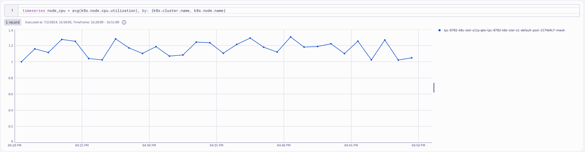

## Deploy OpenTelemetry Collector 

### Contrib Distro - Daemonset (Node Agent)

```yaml
---
apiVersion: opentelemetry.io/v1alpha1
kind: OpenTelemetryCollector
metadata:
  name: dynatrace-metrics-node
  namespace: dynatrace
spec:
  envFrom:
  - secretRef:
      name: dynatrace-otelcol-dt-api-credentials
  env:
    - name: K8S_NODE_NAME
      valueFrom:
        fieldRef:
          fieldPath: spec.nodeName
  mode: "daemonset"
  image: "otel/opentelemetry-collector-contrib:0.103.0"
```
Command:
```sh
kubectl apply -f opentelemetry/collector/metrics/otel-collector-metrics-node-crd-01.yaml
```
Sample output:
> opentelemetrycollector.opentelemetry.io/dynatrace-metrics-node created

### Validate running pod(s)
Command:
```sh
kubectl get pods -n dynatrace
```
Sample output:
| NAME                             | READY | STATUS  | RESTARTS | AGE |
|----------------------------------|-------|---------|----------|-----|
| dynatrace-metrics-node-collector-2kzlp   | 1/1   | Running | 0        | 1m  |

### Create `clusterrole` with read access to Kubernetes objects
```yaml
---
apiVersion: rbac.authorization.k8s.io/v1
kind: ClusterRole
metadata:
  name: otel-collector-k8s-clusterrole-metrics
rules:
  - apiGroups: ['']
    resources: ['events', 'namespaces', 'namespaces/status', 'nodes', 'nodes/spec', 'nodes/stats', 'nodes/proxy', 'pods', 'pods/status', 'replicationcontrollers', 'replicationcontrollers/status', 'resourcequotas', 'services']
    verbs: ['get', 'list', 'watch']
  - apiGroups: ['apps']
    resources: ['daemonsets', 'deployments', 'replicasets', 'statefulsets']
    verbs: ['get', 'list', 'watch']
  - apiGroups: ['extensions']
    resources: ['daemonsets', 'deployments', 'replicasets']
    verbs: ['get', 'list', 'watch']
  - apiGroups: ['batch']
    resources: ['jobs', 'cronjobs']
    verbs: ['get', 'list', 'watch']
  - apiGroups: ['autoscaling']
    resources: ['horizontalpodautoscalers']
    verbs: ['get', 'list', 'watch']
```
Command:
```sh
kubectl apply -f opentelemetry/rbac/otel-collector-k8s-clusterrole-metrics.yaml
```
Sample output:
> clusterrole.rbac.authorization.k8s.io/otel-collector-k8s-clusterrole-metrics created

### Create `clusterrolebinding` for OpenTelemetry Collector service account
```yaml
---
apiVersion: rbac.authorization.k8s.io/v1
kind: ClusterRoleBinding
metadata:
  name: otel-collector-k8s-clusterrole-metrics-crb
subjects:
- kind: ServiceAccount
  name: dynatrace-metrics-node-collector
  namespace: dynatrace
roleRef:
  kind: ClusterRole
  name: otel-collector-k8s-clusterrole-metrics
  apiGroup: rbac.authorization.k8s.io
```
Command:
```sh
kubectl apply -f opentelemetry/rbac/otel-collector-k8s-clusterrole-metrics-crb.yaml
```
Sample output:
> clusterrolebinding.rbac.authorization.k8s.io/otel-collector-k8s-clusterrole-metrics-crb created

### `kubeletstats` receiver
https://opentelemetry.io/docs/kubernetes/collector/components/#kubeletstats-receiver
```yaml
config: |
    receivers:
      kubeletstats:
        collection_interval: 30s
        auth_type: 'serviceAccount'
        endpoint: '${env:K8S_NODE_NAME}:10250'
        insecure_skip_verify: true
        metric_groups:
          - node
          - pod
          - container
```
Default Metrics:

https://github.com/open-telemetry/opentelemetry-collector-contrib/blob/main/receiver/kubeletstatsreceiver/documentation.md

**note:** for this lab, the Kind cluster does not have cluster metadata to collect.  These values will be spoofed for the purposes of this lab.
```yaml
resource/kind:
  attributes:
  - key: k8s.cluster.name
    value: dt-k8s-o11y-kind
    action: insert
```

### Query Node metrics in Dynatrace
DQL:
```sql
timeseries node_cpu = avg(k8s.node.cpu.utilization), by: {k8s.cluster.name, k8s.node.name}
```
Result:

